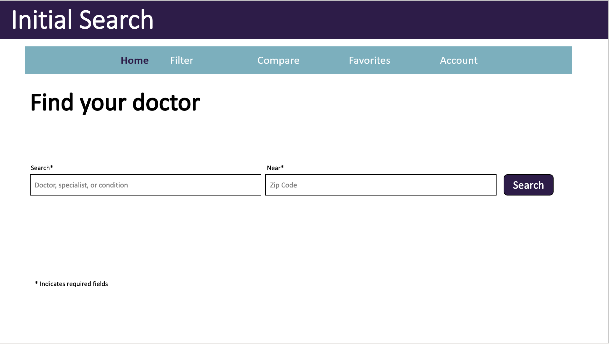
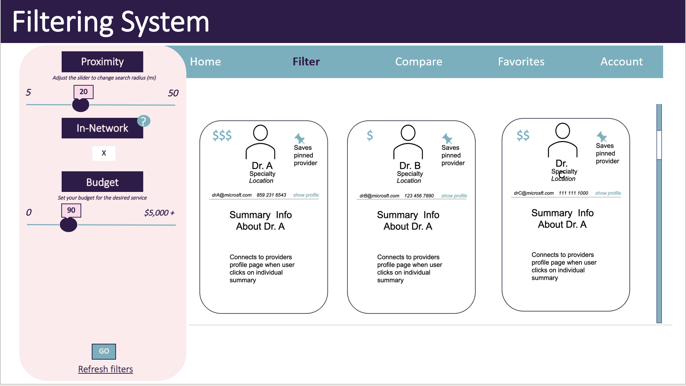
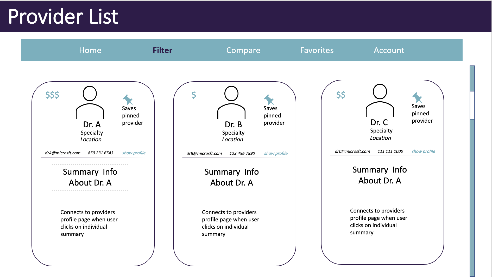
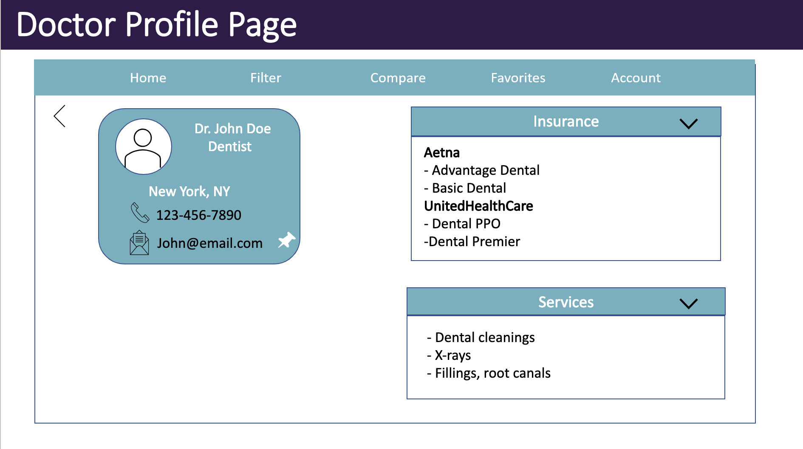
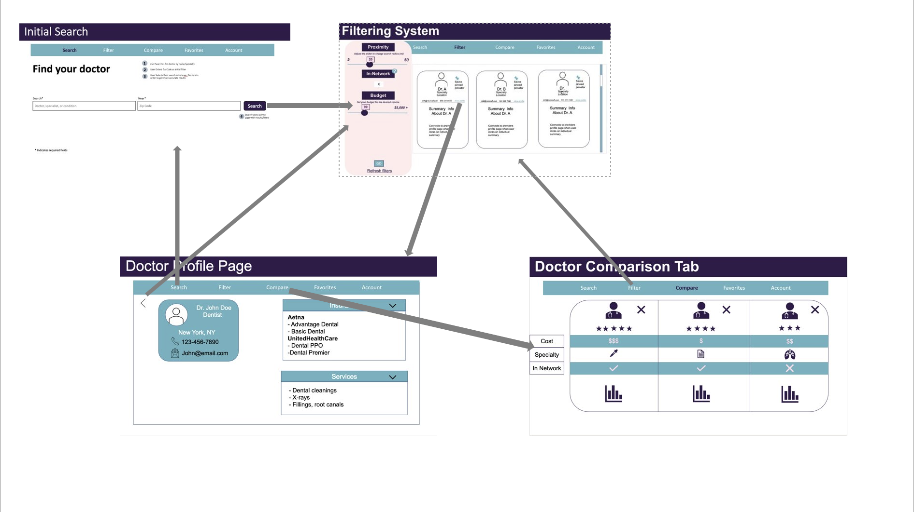

# Carefree

## Problem statement

The lack of transparency and accessibility to information regarding insurance coverage plans prevents young adults from accessing safe and affordable healthcare. 

## Summary

Do you know the cost of a medical visit before you receive the medical bill? Do you feel lost whenever you try to understand your health care? For the young adults like you who are always on the go and have experienced the frustrations of finding information regarding health care services, or the fears of not being able to afford care, Carefree is a web app that helps users identify services that are accessible, affordable, and catered to their needs. Unlike traditional insurance brochures and doctor websites which are hard to navigate, Carefree offers a central, go-to spot in finding the right doctor for the best price. 

## Customer profile

YourShare's initial target market is college students and the communities around college and university campuses.

* Who – young adults ranging from the ages of 18 to 25 
* What – who are not familiar with navigating the healthcare system and are living on very tight budgets 
* Where – within the United States, including rural, suburban, and urban areas 
* Why 
    * A lot of young adults are on a tight budget and struggle to find health care services that are affordable. 
    * Many young adults are seeking healthcare services without parents/guardian help for the first time 
    * Understanding medical terms can be very difficult, and expensive. 
* When – they need to seek a specialized health service, generally after visiting  
* How 
    * Search for services, and filter out options based on preferences 
    * Get a comparison of various providers 

#### User story #1
Sarah is a college senior attending a private Liberal Arts college in New York. She works under a tight budget because she has taken out student loans to support her education. As a college Athlete, Sarah is not only prone to injury but also always on the go and never finds the time to search for affordable services. Everyday Sarah enjoys going on morning runs before class. On Monday, while running Sarah slipped on ice and sprained her ankle. She decided to buy painkillers over the counter and try at-home remedies to treat her injury. As this injury began to affect her ability to play on her team, she decided to seek medical attention after a couple days and asked her friends for recommendations on cheap health service providers in New York.  

#### User story #2
Ojok is a college Freshman who is an international student from Kenya. Ojok is often required to pay out of pocket for some health services after visiting the hospital uncertain of what was covered by the college insurance. The quest for information about in-network services provided by the school motivates Ojok to frequently check the college website. However, Ojok always finds the information on the website confusing with many complex terms.  

#### User story #3
Grace is a young adult that moved from California. She recently graduated from college and now works in a city a few hours from home. Beyond visiting a personal care provider, she isn’t quite aware of which specialists she should visit, and which ones would have access to her medical records. In the past, her parents dealt with the details of scheduling appointments and covering costs, but now that she lives on her own, the terminology and ambiguity in how much a visit will cost discourages her from visiting most doctors. 

## Goals

* To improve accessibility to health care information - People who seek medical attention often lack Information on health care services that are in-network for different coverage plans. Our product will enable users to promptly access information about various health care providers, allowing users to make more informed decisions regarding their health.  
    * Allow users to gain more background knowledge on health care professionals through the doctor’s profile 
    * Provide users with information on the doctoPr’s background and specialties 
    * Help users understand health care terms they may be unfamiliar with 

* Increase informed decision making about the cost of health care services- Our product will provide costs of different health care services to enable users to learn about the affordable services available to them. 
* Provide cost estimates for different health services to the users 

## In scope
### Pages:  
* P0 - Home Page 
* P0 - Doctor Page 
* P0 - Filter Page 
* P0 - Comparison Page 
* P2 - User Profile 

### P0:  
* (All) Navigation Bar 
* (Home) Search Bar 
* (Filter) Proximity, in-Network, budget filters 
* (Filter) Add doctor to comparison list 
* (Filter - Provider List) Display phone number and email on card  
* (Filter - Provider List) Price Gauge  
* (Filter - Provider List) Doctor Card 
* (Doctor) Information sections 
* (Doctor) Doctor’s information 
* (Doctor) Dropdown with services applicable to the individual doctor 
* (Comparison) Full comparison display 
* (Comparison) Remove doctor 

### P1:  
* (All) Complex terms description 
* (Home) Top Searches 
* (Home) Popular Specialties  
* (Filter) More Filters 
* (Filter) Collapsible Filter 
* (Filter - Provider List) Change number of cards viewed 
* (Doctor) Ratings/Testimonies 
* (Doctor) Additional Information 
* (Comparison) Additional Rows – languages, years of practice etc. 

### P2:  
* (User Profile) Favorites 
* (Filter - Provider List) Directly call/email provider 

## Out of scope

The following are not accessible within our product: 
* Users can schedule appointments for the user 
* Users can utilize features to deal with emergency situations 
* Users can receive information about choosing insurance providers 
* Users can receive remedies/solutions for their health-related issues 
* Users can find a diagnosis on their health-related issues 

## UX

Our product will be a web app that will provide in-depth information about different health providers. The walkthrough displays P0, P1, and P2 features, though P1 and P2 features are not included in the minimal viable product. 

### Assumption 

Before the user lands on the search page, we assume that the user: 

* Signs in with an account, inputs personal information that we will use to personalize experience   

* Knows what procedure to get and what provider to visit, and has already visited a general practitioner   

* Can set an appointment with the desired provider without additional help from the app 

The image assets are in the [carefree-screens](carefree/documents/carefree-screens) folder.

### Home Page
Once on the Home page, the user may input a specific provider’s name, field of specialty, or condition they wish to get treated and they will be directed to the filter page when they hit search.  

 

### Filter Page
The Filter page includes a filtering system and a list of providers. Within the filtering system will enable, the user adjusts filters to narrow down provider options. The user moves sliders to determine the size of the search area or indicate the budget to cover medical costs. The user can also specify the search to only in-network providers. For additional support, the user can select and add more filters, as well as collapse the filter to better view options. 

 

The providers list will be a list of providers available based on the filters selected in the filtering system. The list provides summarized information about the providers with an option to call or email them, including a price gauge provide an estimate of how costly the range of provider’s service is in comparison to similar providers. When a user clicks on an individual provider’s card, they will access that doctor’s profile. 

 

### Doctor Page
The Doctor Profile page allows users to gain more background information on local doctors that offer affordable health care services. The doctor page provides information such as insurances accepted, and services offered by that doctor. The user will also be able to view the doctor’s contact information and contact them in order to book an appointment. When the user visits the doctors page, each section will be a drop down, and the user can expand the windows for more information on that topic. 

 

### Comparison Page
The comparison page enables users to get a more in-depth look at multiple doctors at once. Each doctor will have more information than seen on the filter page, and if users want to learn more, they can tap on the doctor and go to the individual page. 

 

### Navigation
This screen describes the app navigation, how the screens of the app are connected. All pages, barring the Doctor page, are accessible through the navigation bar. The Doctor page is accessible through the Filter page only

 

## More
A more detailed version of our spec containing: Work breakdown and SWOT analysis can be found [here](carefree/documents/Spec.pdf) OR [online](https://microsoft.sharepoint-df.com/:w:/t/TNT20202-Christelle/EVZdDLKWZ9hKliFHkhGcJ8EBdpd-GkyLnS0TBepzOSM56A?e=ldPACy)
